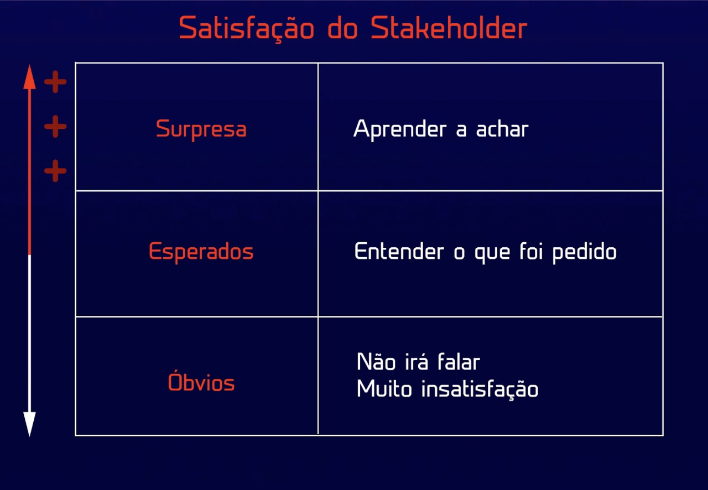
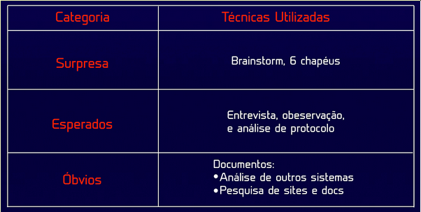
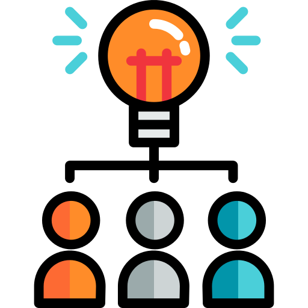
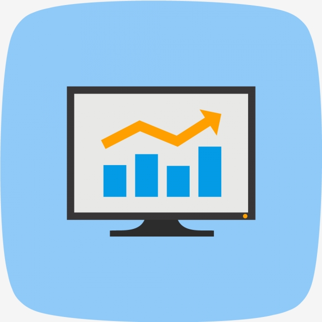

## **Metodologia Utilizada**

&emsp;
Baseado no **modelo Kano** e no **Desdobramento da Função Qualidade (QFD)** o grupo preocupou-se em levantar os requisitos categorizando-os de acordo com a satisfação de um stakeholder.
Na imagem abaixo podemos ver três categorias, categoria de requisitos surpresa, esperados e óbvios. 

    
  
*Imagem 1: categorização dos requisitos a seta a esquerda simboliza o grau de satisfação do stakeholder.*

* 
<b>Requitos Esperados</b>: São requisitos fundamentais no sistema, deve-se entender o que foi pedido. Se esses requisitos estiverem no sistema, deixarão o stakeholder satisfeito, pois o sistema propõe o que foi pedido.

* 
<b>Requisitos Surpresa:</b> São aqueles requisitos que o stakeholder não solicitou, mas você como engenheiro de requisitos estudou muito bem a ideia, deve-se aprender a achar, e propôs além dos requisitos esperados, deixando o stakeholder mais satisfeito ainda.

* 
<b>Requisitos Óbvios:</b> São aqueles requisitos óbvios para o stakeholder, mas para quem irá desenvolver não. Se não entregarmos esses requisitos causará muita insatisfação ao cliente.

&emsp;
A partir dos conceitos apresentados, o grupo procurou realizar as seguintes técnicas para elicitar requisitos da melhor forma possível. A imagem abaixo retrata as técnicas utilizadas.
 

  
*Imagem 2:Técnicas utilizadas*

&emsp;
Para os requisitos surpresas utilizamos técnicas que necessitam amplamente da criatividade, como brainstorm e a técnica dos 6 chapéus.
Já nos requisitos esperados, tentamos fazer a melhor entrevista possível, passando pelo método da observação e aprendizagem. Contando com o auxílio de questionário e utilizando também a técnica de análise de protocolo.  
Em relação aos requisitos óbvios, utilizamos documentos e comparamos com outras aplicações para levantar conceitos básicos acerca do mundo dos investimentos.

## **Requisitos Surpresa**

### **Técnica dos 6 chapéus**

&emsp;
A técnica dos seis chapéus, desenvolvida por Edward de Bono, é uma ferramenta de comunicação e raciocínio muito eficaz. Graças a ela, vemos nossas realidades pessoais a partir de diversos ângulos e perspectivas, aplicando por sua vez o pensamento lateral.

  

&emsp;
O grupo se reuniu, a cada etapa um chapéu era colocado a mesa, o resultado foi, a problemática foi propor novas funcionalidades.

#### **Chapéu Branco**  
* 
(Pedro) Investimento;

* 
(Tiago) Receber dinheiro em cima de Investimento de renda fixa;

* 
(Pedro) Receber dinheiro em cima de Investimento de renda variável;

* 
(Daniel) Plataforma intermediadora de investimentos;

* 
(Lucas M.) Taxa de corretagem.

* 
(Daniel) Fazer com que usuário e instituições financeiras lucrem.

* 
(Lucas L.) Excelente experiência de usuário;

####**Chapéu Preto**
* 
(Daniel) O usuário pode perder dinheiro;

* 
(Tiago) Como as instituições que vendem ações de renda fixa vão ganhar dinheiro;

* 
(Pedro) O usuário que não tiver mínima noção de investimento não se sentirá confortável.

* 
(Lucas M.) Garantir para os usuário que a aplicação é confiável.

#### **Chapéu Amarelo**
* 
(Luís) O usuário pode ganhar dinheiro;

* 
(Luís) Possuir uma equipe de investidores para mostrar o andamento do mercado.

* 
(Lucas M.) Garantir que a plataforma seja mobile e web.

#### **Chapéu Verde**
* 
(Pedro) Pagar uma taxa para as instituições em cima das ações e ganhar dinheiro;

* 
(Daniel) Criar um aplicativo para auxiliar sobre investimentos 

#### **Chapéu Vermelho**
* 
(Tiago) Ganhar Dinheiro;

* 
(Pedro) Aprender a investir;

* 
(Lucas M.) Facilidade em investir;

#### **Chapéu Azul**
* 
(Daniel) Proporcionar um simulador de investimentos;

* 
(Lucas M.) Proporcionar que o usuário aprenda sobre investimento;

* 
(Lucas L.) Proporcionar segurança por meio de digital;

* 
(Daniel) Proporcionar uma experiência de usuário;

* 
(Tiago) Indicação de investimento realizado por analistas;

### **Brainstorming**

&emsp;
O brainstorm é uma técnica bastante conhecida no levantamento de requisitos, o significado literal de brainstorm é “tempestade de ideias” que se refere a uma maneira de deixar fluir pensamentos sem julgamentos entre uma equipe.

 

&emsp;
A equipe utilizou a técnica do brainstorming para levantar os requisitos  surpresa e também ao longo das reuniões para ouvir as opiniões de cada membro. Para organizar as ideias e direcionar as opiniões levantadas, levantamos perguntas chave feita por um possível usuário em torno da ideia de comprar investimentos através de um aplicativo mobile, sempre nos direcionando no sentido de encontrar novidades que surpreendam o usuário.

#### **Como posso saber quais são os investimentos mais adequados para o meu perfil de investidor ?**

* 
 </b>Lucas Leite:</b> Seria interessante categorizar os investimentos por meio de etiquetas ou cores. Dessa forma o usuário saberia sempre que fosse comprar um novo investimento, se aquele investimento é adequado para seu perfil ou não , a etiqueta ou a cor chamaria sua atenção.

* 
 </b>Daniel Sousa:</b> Poderiam existir informações no dashboard inicial indicando os melhores tipos e categorias de investimento para um determinado perfil de investidor, contendo também as informações do porquê comprar determinado investimento e seu custo-benefício.

* 
 </b>Luis Bruno:</b> As opções recomendadas poderiam aparecer em uma lista de “Recomendados” para o usuário, que pode ir direto nessa lista e selecionar o investimento que deseja fazer.

* 
 </b>Lucas Medeiros:</b> Dentro da filtragem de investimentos poderia ter um filtro por recomendação que, quando selecionado, apareciam apenas os investimentos mais adequados para o usuário naquela lista.

#### **Como posso avaliar melhor o risco na realização de determinado investimento ?**

* 
 </b>Lucas Leite**: Poderia haver um indicador de riscos semelhante a um termômetro, onde os níveis mais altos desse “termômetro” indicariam um risco maior de se realizar o investimento, estando esse indicador sempre ao lado de cada cada opção de investimento.

* 
 </b>Daniel Sousa</b>: Dados em formato de gráfico indicando os períodos de maior risco e quanto de dinheiro foi perdido/ganho por outros investidores.

* 
 </b>Luis Bruno</b>:  Os investimentos de maior risco poderiam ser indicados com uma etiqueta e então poderia clicar na etiqueta para obter mais informações. Uma tabela pode ser mostrada com o histórico de variação daquela ação mostrando o porquê de ser de alto risco.

* 
 </b>Lucas Medeiros</b>: O usuário poderia contar com um acervo de informações providas por outros investidores mais experientes, como opiniões, comentários e relatos acerca de cada investimento feito, dessa maneira os dados providos por usuários mais experientes ajudariam aqueles que estão começando a tomar uma decisão mais acertada.

### **Requisitos Surpresa Levantados**

</b>1.</b> Proporcionar um simulador de investimentos.

</b>2.</b> Proporcionar que o usuário aprenda sobre investimento.

</b>3.</b> Proporcionar segurança por meio de digital.

</b>4.</b> Proporcionar uma experiência de usuário.

</b>5.</b> Indicação de investimento realizado por analistas.

</b>6.</b> Informar o risco do investimento por meio de categorias.

</b>7.</b> Filtrar uma lista de investimentos por categorias, risco, rentabilidade e valor.

</b>8.</b> Indicar a porcentagem de variação do valor do investimento no dia.

</b>9.</b> Atualizar de forma constante o valor do investimento, de maneira que o usuário veja a variação em tempo real.

</b>10.</b> Prover informações para o usuário sobre como determinado investimento variou seu valor ao longo dos últimos dias.

</b>11.</b> Dar a possibilidade pro usuário selecionar seus investimentos favoritos, os colocando em uma lista disponibilizada para o usuário.

## **Requisitos Esperados**

### **Observação**

&emsp;
A técnica de observação, como o próprio nome sugere, consiste em observar o problema e tentar entendê-lo, visitando o local em foco com a finalidade de observação do mesmo. Permitindo assim, coletar informações de acordo com o cotidiano das operações e execução dos processos diários do local.

 

&emsp;
O integrante Pedro Miranda passou um tempo observando uma empresa de Fonoaudiologia. Acompanhou de perto o dia a dia dentro do ambiente empresarial, obtendo dados financeiros, assim como, experiências interpessoais.

#### **Ambiente de Observação**

&emsp;
A observação foi realizada em uma clínica fonoaudiológica, dentro do Centro Médico Júlio Adnet em brasília, constituído por equipes focadas em fonoaudiologia, atendimento ao cliente, setor de finanças e gestão.

  

#### **Observando e levantando requisitos**

&emsp;
Pedro visitou a clínica e fixou-se no setor de finanças, observando o dia a dia dos especialistas. Tiago, um dos líderes da clínica e amigo pessoal de Pedro,  foi o responsável por realizarmos com sucesso essa técnica. Durante o processo Pedro reuniu as seguintes informações.

<b>1.</b> O dinheiro que entra na empresa, a receita bruta, é investido através de uma corretora.

<b>2.</b> O que é usado para pagamento de funcionários, impostos, despesas em geral retira-se da aplicação, pois são aplicações com um dia de crédito na conta, se retirarmos o dinheiro hoje, amanhã já está na conta, esse processo chama-se D1.

<b>3.</b> Os investimentos feitos são de renda fixa, divididos entre pós fixados, investimentos atrelados a taxa de juros, e pré fixados, investimentos que trazem um bom retorno no cenário da queda de juros da taxa SELIC.

<b>4.</b> Deve-se ser uma aplicação conservadora porque a empresa não pode ter nada de risco, o patrimônio não pode diminuir, apenas aumentar.

### **Análise de Protocolo**

&emsp;
Para realizarmos a análise de protocolo do Rico foram separadas duas pessoas: Lucas e Bruno, onde uma das pessoas (Bruno) se coloca no papel de usuário da aplicação após efetuar um cadastro bem sucedido e desejar realizar algum tipo de investimento. A outra pessoa (Lucas), registra os passos realizados por Bruno para posteriormente levantar os tópicos de requisitos enumerados. A seguir temos o registro da narração do usuário:

&emsp;
“Eu já possuo uma conta no aplicativo, insiro somente meu usuario e minha senha, que possui uma segurança semelhante à de senha bancária."

&emsp;
"A primeira tela que me deparo após logar apresenta uma visão geral e um dashboard com os gráficos mostrando o resumo dos meus investimentos e variadas opções de investimentos. Como o meu perfil de investidor é conservador, procuro pelos investimentos de renda fixa ou tesouro direto, que são recomendados à mim pelo aplicativo.”

&emsp;  
“Após escolher pelos investimentos de tesouro direto me deparo com diversas opções de investimento mostrando os atributos de cada um: rentabilidade, vencimento e valor mínimo. Escolho uma das opções clicando no ícone do carrinho de compras e me deparo com um formulário de confirmação onde coloco valor, quantidade, senha e a data agendada para efetuar a compra e confirmo o agendamento da compra clicando em comprar, que só possível porque já realizei transferência de saldo para minha conta da Rico.”

&emsp;  
“Depois de clicar em comprar é exibida uma mensagem indicando que o agendamento foi realizado com sucesso, em seguida sou redirecionado para uma página com um quadro de acompanhamento do meu investimento, onde é apresentado o status, protocolo, emissão e valor da compra realizada.”
  

&emsp;
“Visando atualizar o meu perfil de investidor para visualizar e ser notificado com os investimentos mais adequados para mim clico na opção Perfil de Investidor na aba do usuário presente no menu superior e então sou redirecionado para um formulário onde respondo uma série de perguntas a respeito do meu engajamento nos variados tipos de  investimentos incluindo valores que possivelmente serão gastos futuramente, após o preenchimento do formulário confirmo a senha da minha conta para que o Rico registre os dados e me direcione sempre para os investimentos mais adequados para mim.”
  

### **Entrevistas**

&emsp;
Entrevistas são importantes na criação de um excelente software. Sem conhecer as expectativas e os objetivos das partes interessadas e dos usuários, é altamente improvável que ambos ficarão satisfeitos. Deve-se entender e ouvir a perspectiva de cada entrevistado.

&emsp;
O modelo de entrevista utilizado foi a o estruturado, representado por um roteiro de questões previamente estabelecidas, destacando as principais perguntas que deverão ser feitas a cada candidato. 

#### **Perguntas**

<b>1.</b> Qual o seu perfil de investidor (conservador, moderado, agressivo)?
Caso a resposta seja <i>Não</i> deve-se aplicar perguntas para definir perfil de investidor.

<b>2.</b> Qual a sua distribuição entre renda fixa e renda variável?

<b>3.</b> Qual a previsão para retirar os seus investimentos?

<b>4.</b> Você faz uma simulação para rendimento dos seus investimentos?

<b>5.</b> Como você prefere visualizar a sua carteira atual(graf pizza, linha, rendimentos mensais, semanais, diários, etc)?

<b>6.</b> Quais informações você dá prioridade para avaliar um novo investimento?

#### **Perguntas para descobrir o perfil do investidor**

&emsp;
O aplicativo rico possui uma aba para descobrir o perfil do investidor, basta aplicar com o entrevistado.

#### **Um pouco sobre perfil do investidor**

&emsp;
Você pode ser conservador, moderado ou agressivo (também chamado de arrojado). A categoria é definida, de forma geral, de acordo com sua tolerância a riscos. Para saber qual é seu gosto ao risco, algumas características são analisadas.

&emsp;
Você será avaliado pela sua situação financeira (renda e patrimônio), idade, conhecimento do mercado e, claro, seus objetivos.Essas metas de vida normalmente possuem implicações financeiras. Então, é importante saber o prazo e a quantia de dinheiro para os seus objetivos. Os perfis do investidor são:

* 
Conservador: Esse tipo de investidor prioriza a segurança em suas aplicações. Em sua diversificação de investimentos, o conservador deve manter a maior parte da sua carteira de investimentos em produtos de baixo risco. O conservador costuma ser uma pessoa com patrimônio já construído, que provavelmente tem mais de 40 anos e busca apenas a solidez do seu capital. Assim, ele não quer correr mais riscos. Ou então, seja um investidor ainda iniciante que não se sente seguro com os mercados mais dinâmicos.

* 
Moderado: Esse investidor está entre os conservadores e os arrojados. Ele gosta de segurança, mas já possui tolerância a riscos de longo prazo. Assim, opta por investimentos mais arriscados dependendo da situação.

* 
Arrojado ou Agressivo: Esse investidor não sente muito frio na barriga. Ele entende que as perdas a curto prazo são momentâneas e necessárias para aproveitar lucros mais altos a longo prazo.

#### Entrevistados

##### Entrevistado 1

<i>Danillo Teixeira, Contador Mestre</i>

<i>Funcionário público em Ministério da Educação</i>
 

<b>1. Qual o seu perfil de investidor (conservador, moderado, agressivo)?</b>

<i>Moderado, prezo pela segurança de não perder dinheiro, mas às vezes gosto de arriscar um pouco mais.</i>

<b>2. Qual a sua distribuição entre renda fixa e renda variável?</b>

<i>Cerca de 60% fixa / 40% variável.</i>

<b>3. Qual a previsão para retirar os seus investimentos?</b>

<i>Sempre a longo prazo (+ de 10 anos). Recentemente retirei um dinheiro aplicado que me rendeu um bom lucro, usei-o para bancar grande parte de uma viagem para o exterior.</i>

<b>4. Você faz uma simulação para rendimento dos seus investimentos?</b>

<i>Sim. Apenas para renda fixa.</i>

<b>5. Como você prefere visualizar a sua carteira atual(graf pizza, linha, rendimentos mensais, semanais, diários, etc)?</b>

<i>Gráfico de pizza ,  rendimentos mensais seria bastante interessante.</i>

<b>6. Quais informações você dá prioridade para avaliar um novo investimento?</b>

<i>Segurança e rentabilidade, para ações, faço análise gráfica básica.</i>

### **Requisitos Esperados Levantados**

<b>1.</b> Fazer com que o usuário possa investir seus fundos de maneira eficiente e segura.

<b>2.</b> O sistema deve ficar sempre online para que transferências sejam feitas.

<b>3.</b> O usuário deve ser capaz de criar uma nova conta com os dados da sua conta bancária, CPF e comprovante de residência.

<b>4.</b> O usuário deve ser capaz de logar utilizando o seu nome de usuário e uma senha definida por ele no momento do cadastro.

<b>5.</b> O Rico deve apresentar para o usuário os dados dos investimentos já realizados.

<b>6.</b> O usuário deve ser capaz de escolher dentre várias opções e tipos de investimento.

<b>7.</b> O usuário deve poder agendar a data que deseja para comprar os investimentos/ações.

<b>8.</b> O usuário deve ser capaz de visualizar o retorno dos seus investimentos.
 

## **Requisitos Óbvios**

&emsp;
Para o levantamento dos requistos óbvios é necessário identificar quais são os pontos mínimos e básicos para uma plicação nesse segmento. Para isso foram usados outros aplicativos da área para definir quais são os pontos em comum deste setor, além disso foram pesquisadas normas nacionais que regulam aplicações que atuam neste nicho.

### **Requisitos Óbvios Levantados**

<b>1.</b> Visualização do saldo

<b>2.</b> Receber e realizar transferências (apenas para CPF do usuário)

<b>3.</b> Histórico de transações

<b>4.</b> Visualização do histórico de rentabilidade em gráfico de linha

<b>5.</b> Visualização da distribuição dos rendimentos em gráfico de pizza

<b>6.</b> Perfil do usuário

<b>7.</b> Alteração de senha

<b>8.</b> Área para ajuda

<b>9.</b> Definir perfil do investidor

<b>10.</b> Segurança ao guardar os dados do usuário

<b>11.</b> Aplicação deve ser eficiente no que diz respeito ao seu desempenho e velocidade na hora de executar as funcionalidades

### **Histórico de Revisões**

Data | Responsável | Versão | Alteração 
---- | ----------- | ------ | ---------
18/08/2019 | [@tmcstiago](https://github.com/tmcstiago) | 1 | Adicionando Técnicas
25/09/2019 | [@dansousamelo](http://github.com/dansousamelo) | 1.1 | Corrigindo formatação e adicionando conteúdo
25/09/2019 | [@dansousamelo](http://github.com/dansousamelo) | 1.2 | Corrigindo formatação e adicionando conteúdo
26/09/2019 | [@dansousamelo](http://github.com/dansousamelo) | 1.3 | Adicionando técnica de entrevista

### **Referências**
* 
BRUM, Bruno; PENA, Leandro. Engenharia de Requisitos – Técnicas. Brasil, 27 abr. 2011. Disponível em: https://brunobrum.wordpress.com/2011/04/27/principais-tecnicas-de-levantamento-de-requisitos-de-sistemas/. Acesso em: 14 set. 2019.

* 
CALHEIROS, Rafaela. Escolhendo ferramentas: Six Thinking Hats: ou, simplesmente, os Seis Chapéus do Pensamento. Brasil, 5 jul. 2017. Disponível em: https://amenteemaravilhosa.com.br/a-tecnica-dos-seis-chapeus-para-pensar/. Acesso em: 15 set. 2019. 

* 
RIBEIRO, J. L. D.; ECHEVESTE, M. E. & DANILEVICZ, A. M. F. A Utilização do QFD na Otimização de Produtos, Processos e Serviços. Série Monográfica Qualidade. Porto Alegre: UFRGS, 2000.

* 
ROOS, CRISTIANO; SARTORI, SIMONE; GODOY, LEONI PENTIADO. Modelo de KANO para a identificação de atributos capazes de superar as expectativas do cliente. Revista produção online, v. 9, n. 3, 2009.

* 
RICO.COM.VC (Brasil). Qual o Seu Perfil de Investidor - Conservador, Moderado ou Arrojado?. [S. l.], 16 maio 2019. Disponível em: https://blog.rico.com.vc/perfil-de-investidor. Acesso em: 10 set. 2019..

* 
DREXEL UNIVERSITY (Philadelphia, PA). TYPES OF INTERVIEWS. [S. l.], [21--]. Disponível em: https://drexel.edu/scdc/professional-pointers/interviewing/interview-types/. Acesso em: 10 set. 2019.

