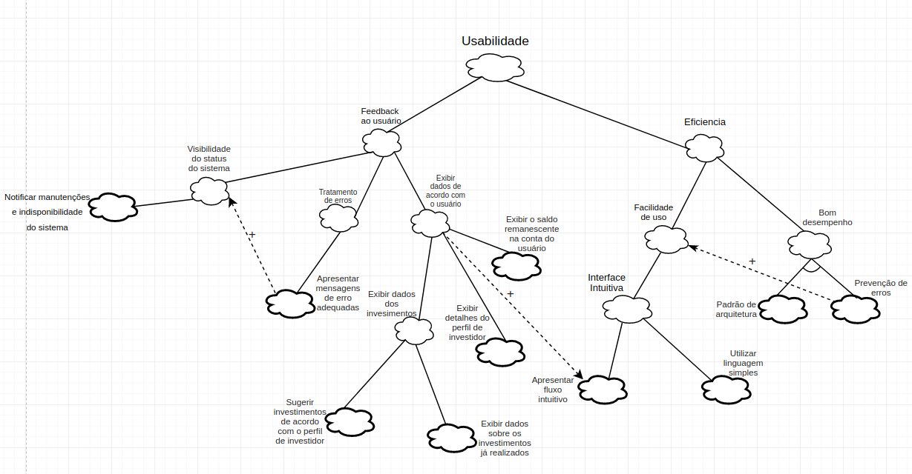

### **Introdução**

&emsp;
    Trata-se de um framework conceitual para condução da Engenharia de Requisitos orientada
    aos requisitos não funcionais, com uma extensão que apoia suposições para avaliação de
    satisfação das metas-flexíveis.

### **Usabilidade v1.0**

    Clique para ampliar

### **Segurança v1.0**

    Clique para ampliar

### **Compatibilidade v1.0**

    Clique para ampliar

### **Referências**	

 * 
SERRANO, Maurício; SERRANO, Milene; Requisitos - Aula 17; Disponível em https://aprender.ead.unb.br/pluginfile.php/730386/mod_resource/content/1/Requisitos%20-%20Aula%20019a.pdf

## Histórico de revisões

| Data       | Responsável                                        | Versão | Alteração                      |
| ---------- | -------------------------------------------------- | ------ | ------------------------------ |
| 20/10/2019 | [@lbrunofidelis](https://github.com/lbrunofidelis) | 1      | Adicionando NFR de Usabilidade |
