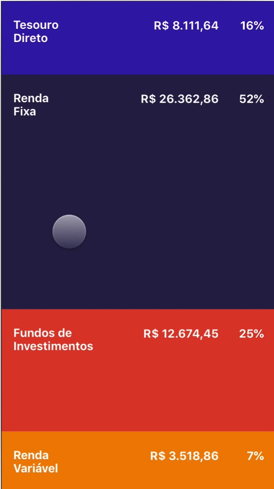

<table>
    <thead>
        <tr>
            <th colspan="2" rowspan="2"> US21 - Eu como um usuário do sistema desejo visualizar a distribuição de investimentos</th>
        </tr>        
    </thead>
</table>

<table>
    <thead>
        <tr>
            <th>Regra/Critério de Aceitação</th>
            <th>Exemplo</th>
            <th>Questionamento</th>
        </tr>        
    </thead>
    <tbody>
         <tr>
            <td>Usuário deve estar na aba da carteira onde estão localizados todos seus investimentos, por categoria</td>
            <td>
                <ul>
                    <li>Usuário logou em sua conta e foi á sua carteira visualizar a distribuição de investimentos - OK</li>
                    <li>O usuário está logado em sua conta e está na aba de configurações - ERRO</li>
                </ul>
            </td>
            <td> - </td>
        </tr>
        <tr>
            <td>Usuário deve ter investido seu patrimônio em no mínimo 1 tipo de investimento</td>
            <td>
                <ul>
                    <li>Usuário comprou 1 ação em fundos de investimento - OK</li>
                    <li>Usuário não possui investimentos realizados - ERRO</li>
                </ul>
            </td>
            <td> - </td>
        </tr>
    </tbody>
</table>

## **Imagem Representantiva**

<i>Exemplo: Tela de distribuição de investimentos</i>
