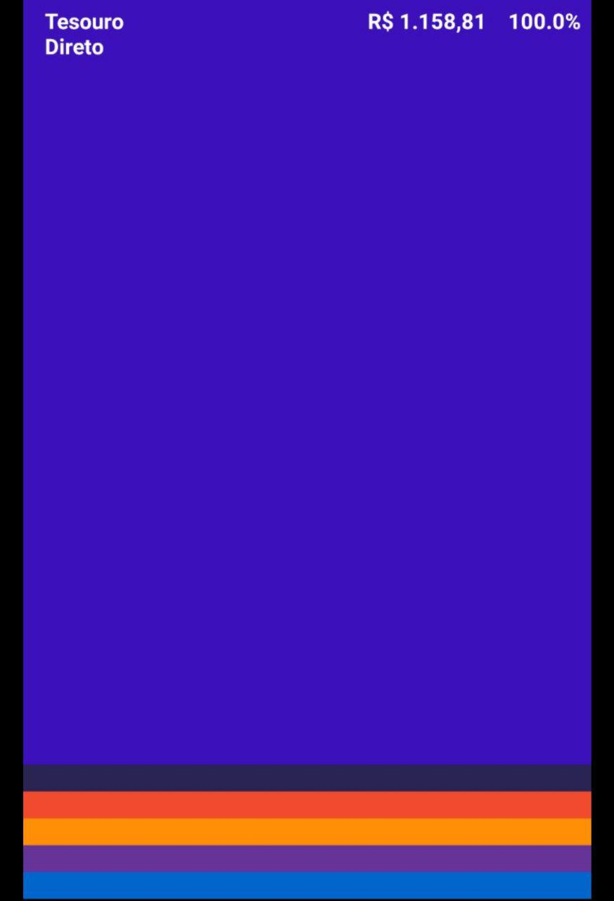

<table>
    <thead>
        <tr>
            <th colspan="2" rowspan="2"> US22 - Eu como um usuário do sistema desejo visualizar as ultimas ordens realizadas no tesouro direto</th>
        </tr>        
    </thead>
</table>

<table>
    <thead>
        <tr>
            <th>Regra/Critério de Aceitação</th>
            <th>Exemplo</th>
            <th>Questionamento</th>
        </tr>        
    </thead>
    <tbody>
        <tr>
            <td>Usuário deve ter investido seu patrimônio em investimentos dentro do tesouro direto</td>
            <td>
                <ul>
                    <li>Usuário comprou 3 aplicações no SELIC - OK</li>
                    <li>Usuário só realizou investimentos dentro de fundos de investimento - ERRO</li>
                </ul>
            </td>
            <td> - </td>
        </tr>
    </tbody>
</table>

<i>Exemplo: Tela de ordens realizadas no tesouro direto</i>
