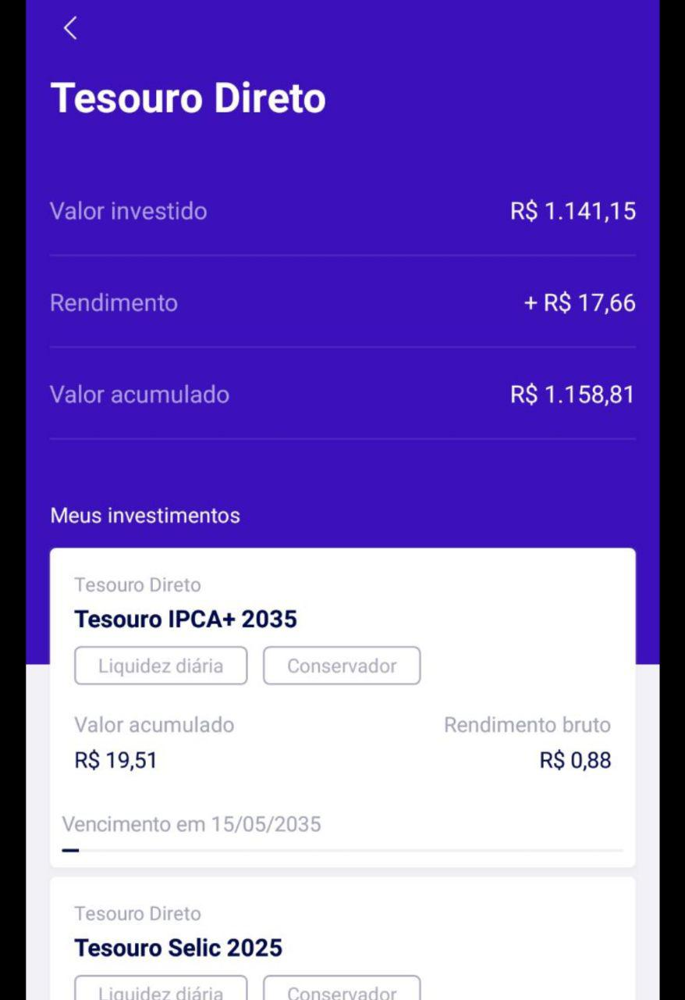

<table>
    <thead>
        <tr>
            <th colspan="2" rowspan="2"> US23 - Eu como um usuário do sistema desejo visualizar informações da ordem realizada no tesouro direto</th>
        </tr>        
    </thead>
</table>

<table>
    <thead>
        <tr>
            <th>Regra/Critério de Aceitação</th>
            <th>Exemplo</th>
            <th>Questionamento</th>
        </tr>        
    </thead>
    <tbody>
        <tr>
            <td>O usuário necessita ter patrimônio o suficiente para realizar uma ordem no tesouro direto</td>
            <td>
                <ul>
                    <li>Usuário possui R$ 150 em sua conta e realiza a compra de 1 ação no SELIC que está custando R$ 103,63 - OK</li>
                    <li>O SELIC está custando R$ 103,63 e o usuário possui R$ 90 - ERRO</li>
                </ul>
            </td>
            <td> - </td>
        </tr>
        <tr>
            <td>O usuário necessita realizar no mínimo um investimento dentro do tesouro direto</td>
            <td>
                <ul>
                    <li>Usuário investiu em 2 ações no tesouro SELIC - OK</li>
                    <li>Usuário não possue ação investida dentro do tesouro direto - ERRO</li>
                </ul>
            </td>
            <td> - </td>
        </tr>
    </tbody>
</table>

<i>Exemplo: Tela de ordens realizadas no tesouro direto</i>
