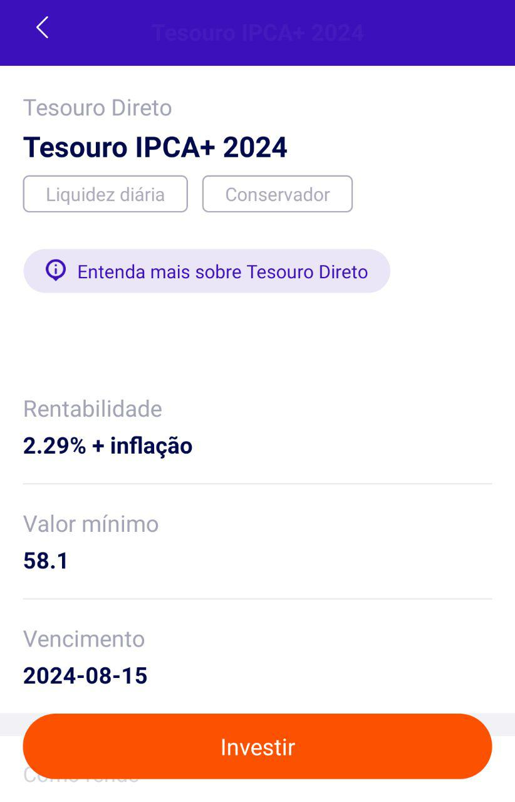

<table>
    <thead>
        <tr>
            <th colspan="2" rowspan="2"> US36 - Eu como um usuário do sistema desejo visualizar os detalhes de um Tesouro Direto</th>
        </tr>        
    </thead>
</table>

<table>
    <thead>
        <tr>
            <th>Regra/Critério de Aceitação</th>
            <th>Exemplo</th>
            <th>Questionamento</th>
        </tr>        
    </thead>
    <tbody>
        <tr>
            <td>O usuário deve pressionar o dedo em cima de alguma ação do Tesouro direto</td>
            <td>
                <ul>
                    <li>O usuário quer saber detalhes do Tesouro IPCA - OK</li>
                    <li>O usuário investe exclusivamente em renda variável - ERRO</li>
                </ul>
            </td>
            <td>
                <ul>
                    
-

                </ul>
            </td>
        </tr>
    </tbody>
</table>

## **Imagem Representantiva**

<i>Exemplo: Tela de detalhes de investimento de tesouro direto</i>
