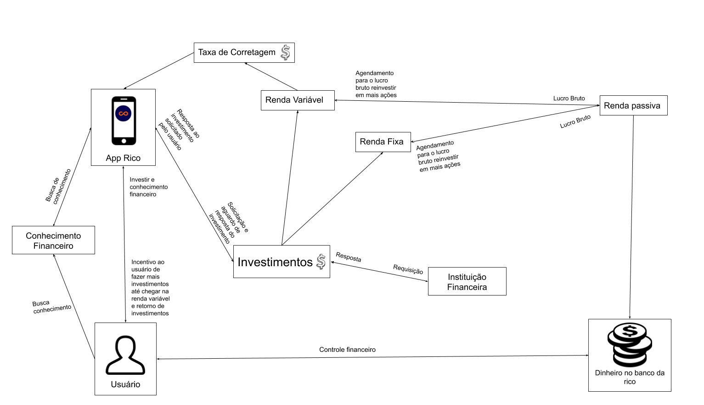
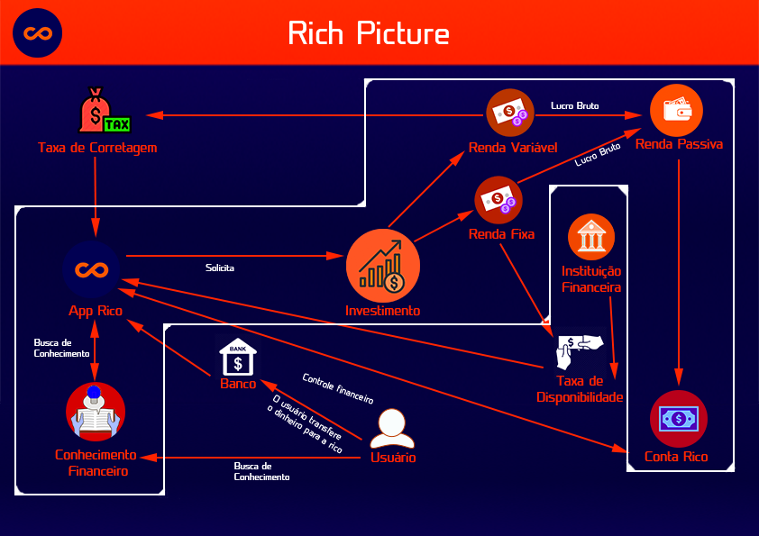

## **Metodologia**

&emsp;
O Rich Picture é um modelo que explora o máximo de elementos e relações entorno de uma certa situação, desta forma, é possivel constatar aspectos que antes passariam despercebidos pelo time.

&emsp;
Inicialmente cada participante do grupo ficou responsável por fazer o Rich Picture de um aplicativo específico, logo, o primeiro Rich Picture foi realizado por um único integrante do grupo. Após a seleção do aplicativo o time se reuniu para produzir uma nova versão do documento com pontos mais detalhados e com mais informações do aplicativo.

&emsp;
Esse Rich Picture foi evoluído conforme a equipe recebia feedbacks e captava mais conhecimento sobre o aplicativo.

## **Versão Individual** 

Visão inicial do fluxo principal do sistema 

## **Versão em Grupo - V0**

<b>Mudanças:</b> O fluxo principal do sistema foi ampliado

## **Versão em Grupo - V1**

<b>Mudanças:</b> O fluxo principal do sistema foi esquematizado com um novo design, erros foram corrigidos

## **Versão em Grupo - V2**

<b>Mudanças:</b> Adicionou-se a fronteira.

## **Histórico de revisões**
Data | Responsável | Versão | Alteração 
---- | ----------- | ------ | ---------
15/09/2019 | [@tmcstiago](https://github.com/tmcstiago) | 1 | Adicionando primeiras versões do Rich Picture
26/09/2019 | [@dansousamelo](http://github.com/dansousamelo) | 1.1 | Corrigindo formatação e adicionando segunda versão do Rich Picture

## **Referências**
 * 
SERRANO, Maurício; SERRANO, Milene; Requisitos - Aula 4; Disponível em https://aprender.ead.unb.br/pluginfile.php/706393/mod_resource/content/1/Requisitos%20-%20Aula%2004.pdf.
